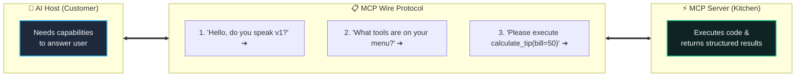
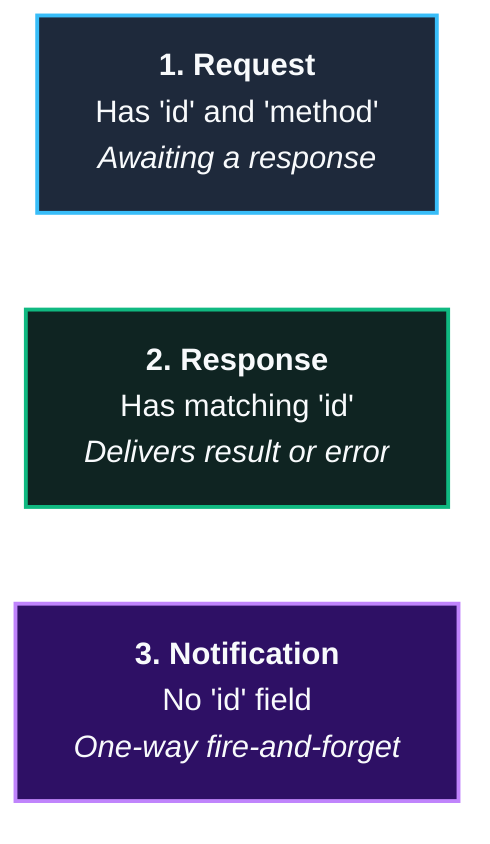
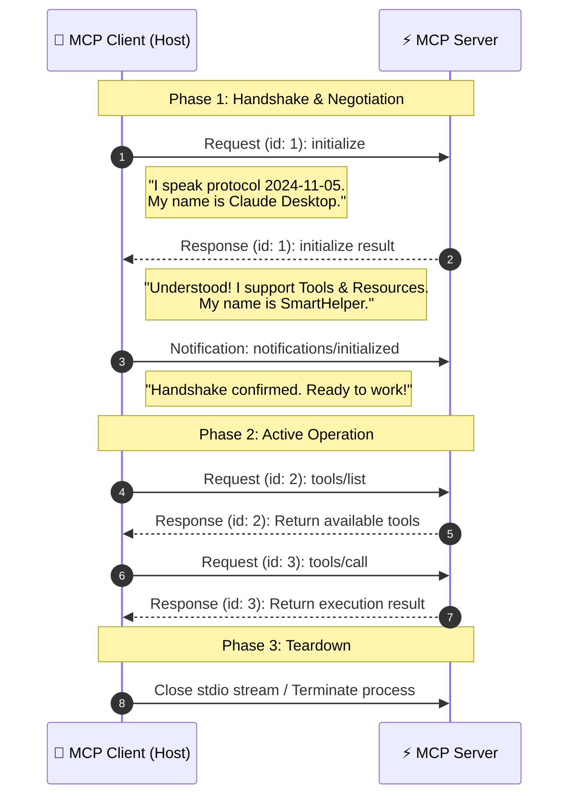
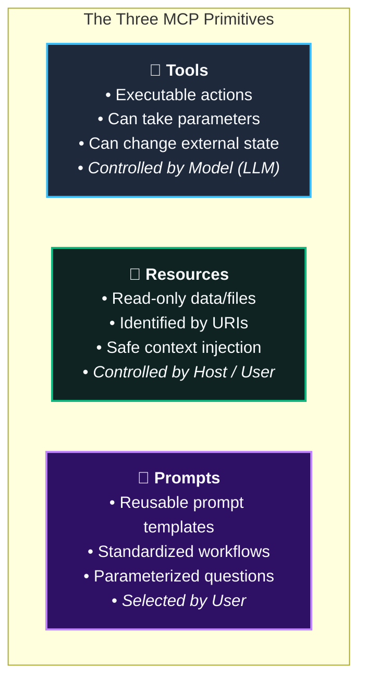
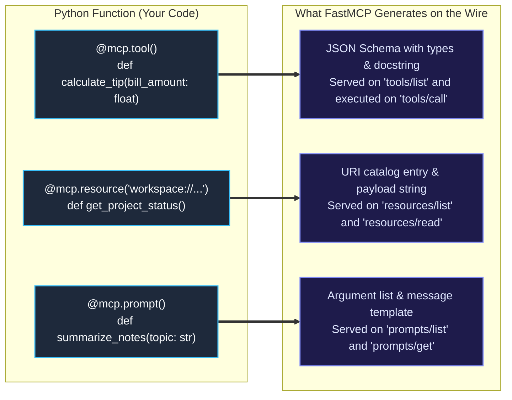
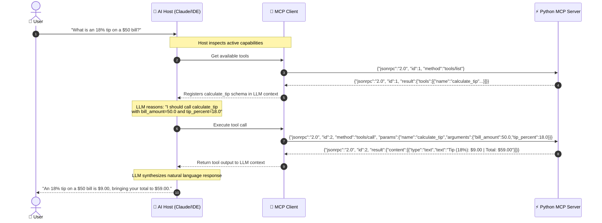

In [Phase 0: What Is MCP and Why Do We Need It?](/blog/what_is_mcp_and_why_do_we_need_it), we saw how the **Model Context Protocol (MCP)** solves the N×M integration problem by giving AI hosts a universal adapter to reach tools, files, and databases.

Now comes the fun part: **taking off the outer casing and looking inside.**

If you ask two software engineers how an AI assistant actually runs an external tool, you often hear words like *"agent orchestration"*, *"model grounding"*, or *"function calling abstraction."* These sound impressive, but they obscure what is actually happening.

Underneath all the AI marketing, MCP is simply two computer programs passing standard text messages back and forth. No magic, no black boxes.

In this guide, we will break down the protocol step-by-step:
1. How messages travel through pipes and HTTP streams (**The Transports**).
2. The simple message format they speak (**JSON-RPC 2.0**).
3. How they greet each other and agree on rules (**The Handshake**).
4. The three core primitives (**Tools, Resources, and Prompts**).
5. A complete, runnable Python MCP server you can run locally and inspect.

---

## 1. The Intuitive Mental Model: Ordering at a Restaurant

Before looking at raw JSON packets, keep this simple analogy in mind.

Imagine an AI Host (like Claude Desktop, Cursor, or your custom bot) is a **customer** sitting at a restaurant, and the MCP Server is the **kitchen**:



1. **The Handshake:** The customer greets the kitchen: *"Hi, I'm Cursor v1.0. Do you support MCP protocol version 2024-11-05?"* The kitchen replies: *"Yes, and here is what I can do."*
2. **Capability Discovery:** The customer asks: *"What tools are on your menu today?"* (`tools/list`). The server hands over a list of available functions and their expected parameters.
3. **Execution:** The customer places an order: *"Please execute `calculate_tip` for a \$50 bill"* (`tools/call`). The kitchen runs the code and serves the answer back: *"\$10 tip, \$60 total."*
4. **Context (Resources):** The customer asks to read today's specials board (`resources/read`).
5. **Workflow Templates (Prompts):** The customer asks for a recommended ordering checklist (`prompts/get`).

That's the entire core lifecycle of MCP. Now let's see how these messages physically move.

---

## 2. The Transport Layer: How Bytes Travel

MCP explicitly separates **how messages are sent** (the transport) from **what messages say** (the protocol).

You can run MCP over two primary transport modes:

```mermaid
flowchart TB
    classDef host fill:#1e293b,stroke:#38bdf8,stroke-width:1.5px,color:#f8fafc
    classDef pipe fill:#1e1b4b,stroke:#818cf8,stroke-width:1.5px,color:#e0e7ff
    classDef srv fill:#0f2422,stroke:#10b981,stroke-width:1.5px,color:#f8fafc

    subgraph Mode1 ["Mode A: Local Process Communication (stdio)"]
        direction LR
        H1["🖥️ AI Host Process<br/><small>(e.g. Claude Desktop)</small>"]:::host
        P1["📟 Standard I/O Pipes<br/><small>Client writes stdin ➔<br/>Server replies stdout ➔</small>"]:::pipe
        S1["⚡ Local MCP Server<br/><small>(Python / Node subprocess)</small>"]:::srv
        H1 <===> P1 <===> S1
    end

    subgraph Mode2 ["Mode B: Remote Network Communication (SSE / HTTP)"]
        direction LR
        H2["🖥️ AI Host Process<br/><small>(Client anywhere)</small>"]:::host
        P2["🌐 HTTP + SSE Stream<br/><small>Client sends HTTP POST ➔<br/>Server pushes SSE events ➔</small>"]:::pipe
        S2["⚡ Remote MCP Server<br/><small>(Cloud API / Container)</small>"]:::srv
        H2 <===> P2 <===> S2
    end
```



### Standard I/O (`stdio`): Best for Local Tools

When Claude Desktop or VS Code connects to an MCP server on your laptop, it **spawns the server as a child process**.

* **Inbound (`stdin`):** The host writes newline-delimited JSON messages directly into the server's standard input stream.
* **Outbound (`stdout`):** The server prints its JSON responses directly to standard output.
* **Diagnostics (`stderr`):** The server sends logs and print statements to `stderr` so they do not corrupt the JSON message stream.

<Callout>
  <strong>💡 Why <code>stdio</code> is popular:</strong> There are no network ports to configure, no firewall warnings, and no localhost port conflicts. When the host closes, the server process shuts down automatically.
</Callout>

### Server-Sent Events (`SSE` / HTTP): Best for Remote Services
When the server runs in the cloud, inside Docker, or on a remote machine:
- **Client ➔ Server:** The client issues regular HTTP POST requests containing JSON-RPC payloads.
- **Server ➔ Client:** The server pushes messages back down an open HTTP Server-Sent Events (`text/event-stream`) connection.

Regardless of whether messages travel over a local pipe or an HTTP connection, the format inside is always the same: **JSON-RPC 2.0**.

---

## 3. The Protocol Standard: JSON-RPC 2.0

MCP uses **JSON-RPC 2.0**, an ultra-lightweight open standard for remote procedure calls.

Every message exchanged between a client and an MCP server is a JSON object belonging to one of three message types:



### 1. Request (Needs an Answer)
A request asks the other side to do something. It includes:
- `jsonrpc`: Must be `"2.0"`.
- `id`: A unique number or string so the response can be matched back.
- `method`: The command to execute (e.g., `"tools/call"`).
- `params`: The inputs needed for that command.

```json
{
  "jsonrpc": "2.0",
  "id": 101,
  "method": "tools/call",
  "params": {
    "name": "calculate_tip",
    "arguments": {
      "bill_amount": 50.0,
      "tip_percent": 20.0
    }
  }
}
```

### 2. Response (The Answer)
A response must include the exact same `id` as the request it answers.

**Successful Response (`result`):**
```json
{
  "jsonrpc": "2.0",
  "id": 101,
  "result": {
    "content": [
      {
        "type": "text",
        "text": "Tip (20%): $10.00 | Total: $60.00"
      }
    ],
    "isError": false
  }
}
```

**Error Response (`error`):**
If something goes wrong (e.g., bad arguments), the server sends back an `error` object with standard error codes:
```json
{
  "jsonrpc": "2.0",
  "id": 101,
  "error": {
    "code": -32602,
    "message": "Invalid params: 'bill_amount' must be a positive number."
  }
}
```

### 3. Notification (Fire-and-Forget)
A notification is a one-way announcement. **It does NOT have an `id` field**, meaning the receiver must never send a reply back.

```json
{
  "jsonrpc": "2.0",
  "method": "notifications/initialized"
}
```

---

## 4. Session Lifecycle: The 3-Step Handshake

Before any tools can run, the client and server must greet each other and negotiate what features they support. This is called the **initialization handshake**.



### Step 1: Client Sends `initialize`
The client opens the channel and introduces itself:
```json
{
  "jsonrpc": "2.0",
  "id": 1,
  "method": "initialize",
  "params": {
    "protocolVersion": "2024-11-05",
    "capabilities": {
      "roots": { "listChanged": true }
    },
    "clientInfo": {
      "name": "ClaudeDesktop",
      "version": "1.0.0"
    }
  }
}
```

### Step 2: Server Replies with Capabilities
The server verifies the protocol version and reports what features it offers:
```json
{
  "jsonrpc": "2.0",
  "id": 1,
  "result": {
    "protocolVersion": "2024-11-05",
    "capabilities": {
      "tools": { "listChanged": true },
      "resources": { "subscribe": false, "listChanged": true },
      "prompts": { "listChanged": false }
    },
    "serverInfo": {
      "name": "SmartHelperServer",
      "version": "1.0.0"
    }
  }
}
```

### Step 3: Client Confirms with `notifications/initialized`
The client sends a one-way notification saying: *"I received your capabilities. We are officially ready."*
```json
{
  "jsonrpc": "2.0",
  "method": "notifications/initialized"
}
```

Until this notification is sent, the server will reject any other tool or resource requests.

---

## 5. The Three Primitives: Tools, Resources, and Prompts

Every capability exposed by an MCP server belongs to one of three primitives. Understanding the difference between them is crucial:



| Primitive | Real-World Analogy | Who Decides to Use It? | Key Wire Methods |
| :--- | :--- | :--- | :--- |
| **Tools** | Calling an API or running a calculator | **The LLM** (model decides to call it when answering) | `tools/list`<br/>`tools/call` |
| **Resources** | Reading a text file or database row | **The AI Host / User** (injected into context) | `resources/list`<br/>`resources/read` |
| **Prompts** | Selecting a prompt shortcut template | **The User** (picked in UI like `/review`) | `prompts/list`<br/>`prompts/get` |

---

### Primitive 1: Tools (Action & Calculation)

Tools allow the model to interact with the real world: run math, send an email, update a database, or query an API.

#### Step A: Discovery (`tools/list`)
The host asks what tools exist. The server returns JSON Schema definitions for each tool:

**Wire Request:**
```json
{
  "jsonrpc": "2.0",
  "id": 2,
  "method": "tools/list"
}
```

**Wire Response:**
```json
{
  "jsonrpc": "2.0",
  "id": 2,
  "result": {
    "tools": [
      {
        "name": "calculate_tip",
        "description": "Calculates tip and total amount for a bill.",
        "inputSchema": {
          "type": "object",
          "properties": {
            "bill_amount": {
              "type": "number",
              "description": "The subtotal of the bill"
            },
            "tip_percent": {
              "type": "number",
              "description": "Percentage to tip, default is 15.0"
            }
          },
          "required": ["bill_amount"]
        }
      }
    ]
  }
}
```

#### Step B: Invocation (`tools/call`)
When the model wants to run this tool, it generates the arguments. The host packages them into a `tools/call` message:

**Wire Request:**
```json
{
  "jsonrpc": "2.0",
  "id": 3,
  "method": "tools/call",
  "params": {
    "name": "calculate_tip",
    "arguments": {
      "bill_amount": 50.0,
      "tip_percent": 18.0
    }
  }
}
```

**Wire Response:**
```json
{
  "jsonrpc": "2.0",
  "id": 3,
  "result": {
    "content": [
      {
        "type": "text",
        "text": "Tip (18%): $9.00 | Total: $59.00"
      }
    ],
    "isError": false
  }
}
```

---

### Primitive 2: Resources (Context & Documents)

Resources provide read-only context. Think of them like URLs for your AI application. They are identified by distinct URI patterns (e.g. `workspace://project-status` or `file:///logs/app.log`).

#### Step A: Discovery (`resources/list`)
**Wire Request:**
```json
{
  "jsonrpc": "2.0",
  "id": 4,
  "method": "resources/list"
}
```

**Wire Response:**
```json
{
  "jsonrpc": "2.0",
  "id": 4,
  "result": {
    "resources": [
      {
        "uri": "workspace://project-status",
        "name": "Current Project Status",
        "description": "JSON summary of current sprint progress",
        "mimeType": "application/json"
      }
    ]
  }
}
```

#### Step B: Reading Content (`resources/read`)
**Wire Request:**
```json
{
  "jsonrpc": "2.0",
  "id": 5,
  "method": "resources/read",
  "params": {
    "uri": "workspace://project-status"
  }
}
```

**Wire Response:**
```json
{
  "jsonrpc": "2.0",
  "id": 5,
  "result": {
    "contents": [
      {
        "uri": "workspace://project-status",
        "mimeType": "application/json",
        "text": "{\"project\": \"MCP Starter\", \"status\": \"active\", \"version\": \"1.0.0\", \"tasks_completed\": 5}"
      }
    ]
  }
}
```

---

### Primitive 3: Prompts (Reusable Workflow Starters)

Prompts let an MCP server offer pre-engineered prompt templates with dynamic variables.

#### Fetching a Prompt (`prompts/get`)
**Wire Request:**
```json
{
  "jsonrpc": "2.0",
  "id": 6,
  "method": "prompts/get",
  "params": {
    "name": "summarize_notes",
    "arguments": {
      "topic": "Sprint Retrospective"
    }
  }
}
```

**Wire Response:**
```json
{
  "jsonrpc": "2.0",
  "id": 6,
  "result": {
    "description": "Executive summary prompt template",
    "messages": [
      {
        "role": "user",
        "content": {
          "type": "text",
          "text": "You are an expert researcher. Please provide a concise 3-bullet executive summary of our notes regarding: Sprint Retrospective."
        }
      }
    ]
  }
}
```

---

## 6. Practical Implementation: Building the Server in Python

Now that you know every message on the wire, let's look at how little code is actually required to create this server.

Using the official Python `mcp` SDK and its **FastMCP** framework, the library automatically translates Python functions, type hints, and docstrings directly into the JSON-RPC wire format.

Here is the complete, runnable Python script:

```python
# phase-1-fundamentals/code/sdk_example_server.py
"""
Smart Helper MCP Server
Demonstrates Tools, Resources, and Prompts over Standard I/O (stdio).
"""
from mcp.server.fastmcp import FastMCP

# Initialize our MCP server with an identity name
mcp = FastMCP("Smart Helper Server")

# ==============================================================================
# 1. TOOL: Model-Controlled Executable Function
# ==============================================================================
@mcp.tool()
def calculate_tip(bill_amount: float, tip_percent: float = 15.0) -> str:
    """
    Calculates tip and total amount for a given restaurant bill.
    
    Args:
        bill_amount: The subtotal amount before tip.
        tip_percent: Percentage to tip (default: 15.0%).
    """
    if bill_amount <= 0:
        return "Error: bill_amount must be greater than zero."
        
    tip = bill_amount * (tip_percent / 100.0)
    total = bill_amount + tip
    return f"Tip ({tip_percent:.0f}%): ${tip:.2f} | Total: ${total:.2f}"

@mcp.tool()
def add_numbers(a: float, b: float) -> str:
    """Adds two numbers together and returns the sum."""
    return f"Sum: {a + b}"

# ==============================================================================
# 2. RESOURCE: Host/User-Controlled Read-Only Context
# ==============================================================================
@mcp.resource("workspace://project-status")
def get_project_status() -> str:
    """Provides current project health, version, and completed tasks."""
    return (
        '{"project": "MCP Starter", "status": "active", '
        '"version": "1.0.0", "tasks_completed": 5}'
    )

# ==============================================================================
# 3. PROMPT: Pre-engineered Prompt Template
# ==============================================================================
@mcp.prompt()
def summarize_notes(topic: str) -> str:
    """
    Generates an executive prompt asking the model to summarize notes on a topic.
    """
    return (
        f"You are an expert researcher. Please provide a concise 3-bullet "
        f"executive summary of our notes regarding: {topic}."
    )

# ==============================================================================
# RUN SERVER
# ==============================================================================
if __name__ == "__main__":
    # Runs the server loop listening on stdio (stdin / stdout)
    mcp.run()
```

### How FastMCP Maps to the Wire

Notice how cleanly FastMCP abstracts away the boilerplate:



When you write Python type annotations like `bill_amount: float` and a docstring, FastMCP automatically builds the corresponding JSON Schema for `tools/list` without you writing a single line of schema validation!

---

## 7. Complete End-to-End Wire Trace

Let's put everything together. What does a full real-world interaction look like when a user asks:
> *"What would an 18% tip be on a \$50 bill?"*

Here is the exact message sequence:



Notice how clean the boundary is:
- The **User** only talks to the **AI Host**.
- The **Host** orchestrates the LLM and decides when tools are needed.
- The **Client** and **Server** communicate strictly through standard **JSON-RPC 2.0 messages**.
- The **Server** simply executes Python logic and returns results.

---

## Summary & Key Takeaways

1. **Lightweight & Standardized:** MCP is not a bulky framework—it is a standardized JSON-RPC 2.0 protocol over standard input/output (`stdio`) or HTTP streams (`SSE`).
2. **Explicit Handshake:** Every connection begins with an `initialize` request and an `initialized` notification where client and server negotiate supported capabilities.
3. **The Three Primitives:**
   - **Tools:** Dynamic executable actions called autonomously by the model.
   - **Resources:** Read-only context and file contents identified by URIs.
   - **Prompts:** Pre-packaged prompt templates and workflows chosen by users.
4. **FastMCP Simplifies Creation:** In Python, decorators like `@mcp.tool()` automatically construct JSON schemas from native type hints and docstrings.

---

> [!TIP]
> **Try It Live with the MCP Inspector!**
> You can test and inspect this exact Python server using the official graphical debugger tool from Anthropic:
> ```bash
> # 1. Install dependencies
> pip install "mcp[cli]"
> 
> # 2. Run with the interactive web Inspector
> npx @modelcontextprotocol/inspector python phase-1-fundamentals/code/sdk_example_server.py
> ```
> The inspector will open in your browser, perform the initial handshake, and allow you to view raw JSON-RPC messages and click to invoke your tools live!

All sample code, wire logs, and companion notes are available in the open-source series repository:
[github.com/Magnificent-steiner0/MCP-for-Dummies](https://github.com/Magnificent-steiner0/MCP-for-Dummies)
