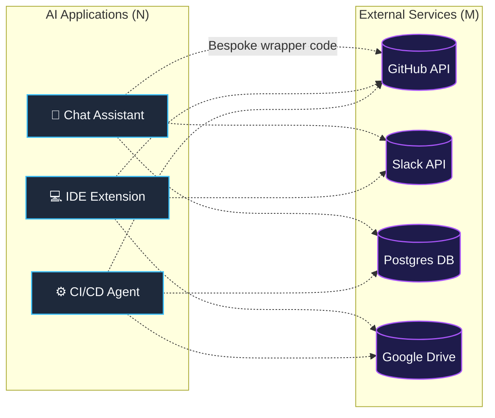
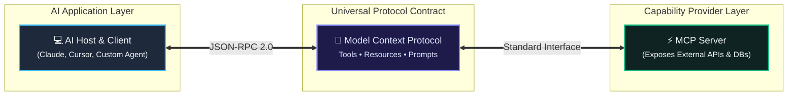
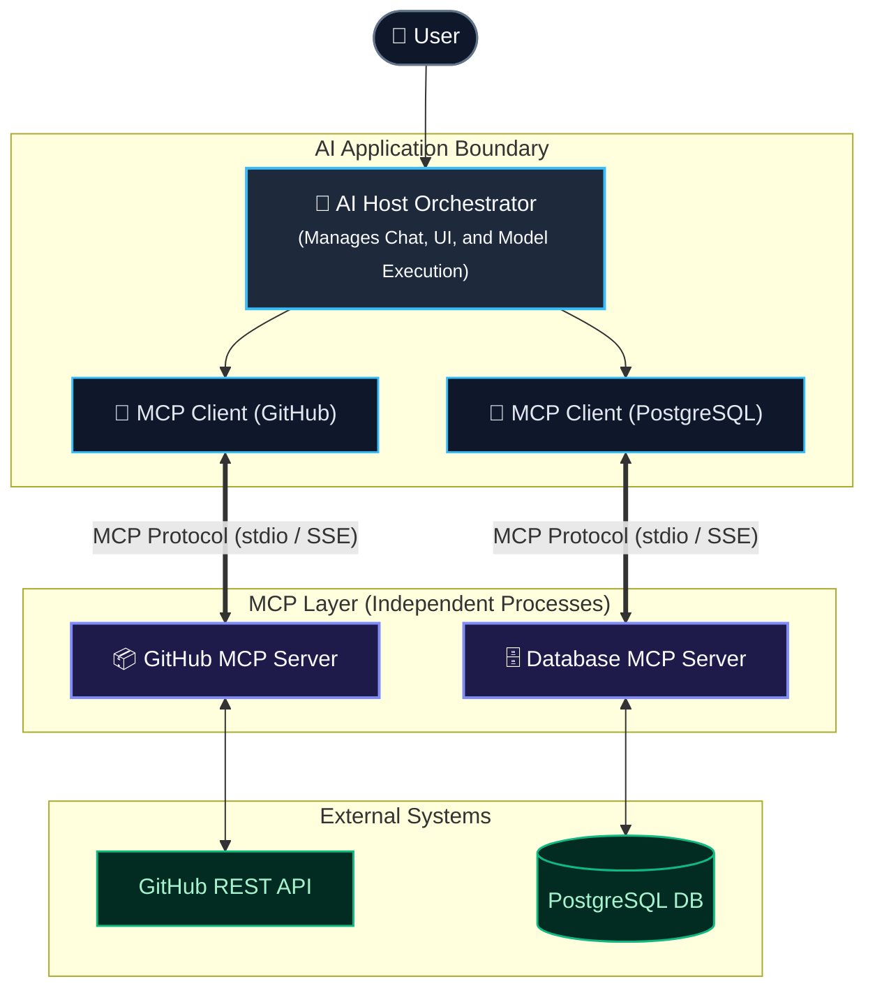
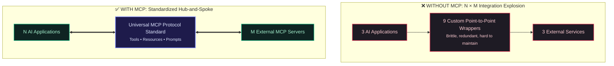
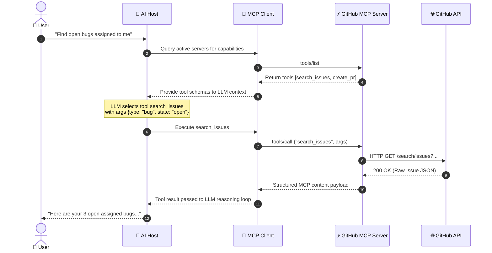
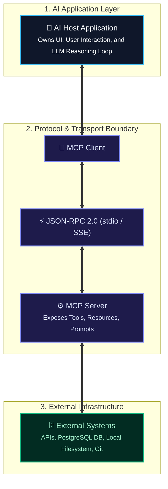

When building modern AI applications, the initial prototype always feels fast and straightforward. You prompt a Large Language Model (LLM), send it a message, and receive a well-formatted textual response. 

However, real-world usefulness requires context and action. An AI assistant restricted purely to its training weights is isolated from your actual work environment. To build something genuinely useful, you quickly discover that your application needs external capabilities: querying a database, reading a repository, inspecting issue trackers, or invoking internal enterprise REST endpoints.

As requirements expand, an integration bottleneck emerges. Understanding why this bottleneck happens—and how to eliminate it systematically—is the foundation of the **Model Context Protocol (MCP)**.

---

## The Problem Before MCP

Consider how AI applications traditionally connect to external systems. When you build a bespoke AI assistant, you write custom integration code for every external service it needs to reach.

For a single application needing access to GitHub, Slack, and a PostgreSQL database, the architecture looks simple:

* **AI Application A** → writes custom code for GitHub API
* **AI Application A** → writes custom code for Slack API
* **AI Application A** → writes custom code for PostgreSQL connection

The architecture degrades rapidly when multiple AI applications enter the environment. Imagine a company deploying three distinct AI applications: an internal Slack bot, a developer IDE extension, and an automated deployment agent. Each needs access to the same underlying systems.

Without a standard protocol, every application re-implements its own integration logic from scratch.

### The N × M Integration Explosion

If you have **N** AI applications and **M** external systems, you face up to **N × M** separate integration efforts. This model suffers from clear structural drawbacks:

- **Duplicated Engineering Effort:** Every engineering team writes custom wrapper code for the same API over and over again.
- **Brittle Codebases:** Whenever an external API updates, every AI application consuming that API directly must update its custom wrapper code.
- **Inconsistent Security & Auth:** Authentication tokens, user permissions, and scope checks are managed independently across every app, expanding the overall attack surface.
- **Non-reusable Context:** Tool definitions and contextual data prompts built for Application A cannot easily be reused inside Application B.

> **Key Question:** What if AI applications didn't need a custom, bespoke integration for every single service they wanted to use?

---

## Why AI Makes This Problem More Interesting

Connecting a traditional application to a REST API is a deterministic process: an engineer writes code to call `GET /issues?assigned=me`, parses the predictable JSON response, and renders it in a UI component.

AI systems operate differently. An LLM does not inherently know what APIs exist or when to call them. To enable an AI model to interact with external tools, your application must provide the model with structural metadata:

- **Discovery:** What capabilities exist right now?
- **Schema:** What parameter names and data types does a given tool accept?
- **Context:** What state or background documents are relevant to the user's prompt?
- **Invocation Format:** How must the model formulate its tool call response so the application can execute it?

Take a user request like: *"Find the latest issue assigned to me on GitHub."*

To satisfy this request without a standardized protocol, your application must manually convert GitHub's API specs into function schemas the LLM understands, pass them in the system prompt, catch the LLM's structured tool call request, execute the HTTP fetch, translate the raw JSON into readable text, and pass it back into the model context. 

Doing this repeatedly across dozens of services quickly leads to unmaintainable codebases.

---

## So, What Is MCP?

The **Model Context Protocol (MCP)** is an open standard designed to solve this integration fragmentation.

Rather than building custom bridges between every AI application and every database or service, MCP provides a standard protocol for AI applications to discover and interact with external data and capabilities.

Conceptually, think of MCP as a standardized communication adapter. Instead of designing a custom electrical connection for every household device, power outlets adhere to a universal standard. MCP brings that same standard interface to the software layer between AI models and external capabilities.

It is important to clarify: MCP is **not** a physical standard or a proprietary framework. It is a structured software protocol defining how messages, tool definitions, resource contents, and prompt templates are exchanged across software process boundaries.

---

## The Basic MCP Architecture

MCP uses an explicit **Client-Server** model where responsibilities are separated cleanly into distinct layers:

### Core Architecture Components

* **AI Host / Application:** The top-level software program managing the user interaction, UI, and LLM reasoning loop (for example, Claude Desktop, a custom IDE plugin, or a backend agent application).
* **MCP Client:** A software component embedded within the AI Host that maintains standard connections, issues queries, and routes protocol messages to MCP servers. An AI host can maintain multiple active MCP clients simultaneously.
* **MCP Server:** A lightweight server process that exposes specific external capabilities through standardized MCP primitives (Tools, Resources, and Prompts).
* **External Systems:** The target underlying infrastructure—such as a local filesystem, a distant PostgreSQL database, or a third-party API like GitHub or Slack.

---

## What Changes With MCP?

When MCP is introduced, the architecture shifts from an **N × M** messy mesh network to a **1 × N** and **1 × M** hub-and-spoke standard.

| Aspect | Without MCP | With MCP |
| :--- | :--- | :--- |
| **Integration Complexity** | **N × M** bespoke custom integrations | **1 × N** Clients & **1 × M** Servers |
| **Service Author Task** | Write separate SDKs/connectors for every AI framework | Write **one** MCP Server usable by all compliant clients |
| **Maintenance Burden** | Updating an API breaks custom code across every app | Updating the server updates capabilities for all clients automatically |
| **Separation of Concerns** | Context logic and API logic are mixed inside the AI app | Clear boundary: Server handles domain logic; Host handles LLM reasoning |

> **Important Nuance:** MCP does not eliminate underlying APIs. Instead, the MCP Server sits between the standardized MCP Protocol and the external system's underlying native API, acting as a structured, AI-ready translation layer.

---

## Visualizing the Shift: Before vs. After MCP

By decoupling *where the capability is used* (the AI Application) from *how the capability is provided* (the MCP Server), any AI application with an MCP client can immediately consume any existing MCP server without writing new integration code.

---

## Trace: A Simple Request Through MCP

To see how these pieces work together conceptually, trace what happens when a user submits a query to an MCP-enabled AI application:

> **User Query:** *"Find the open bugs assigned to me and summarize them."*

### What Happens Step-by-Step?

- **User Request:** The user asks a question requiring external data.
- **Capability Discovery:** The AI Host asks its internal MCP Clients what capabilities are currently available from connected MCP Servers.
- **Schema Injection:** The MCP Client collects tool descriptions and parameter schemas from the servers and provides them to the LLM as available tools.
- **Model Decision:** The LLM decides it needs to invoke a specific tool (`search_issues`) and generates a structured request containing the appropriate parameters.
- **Execution Routing:** The AI Host routes this tool call through the MCP Client over the protocol to the corresponding MCP Server.
- **External Fetch:** The MCP Server translates the protocol call into actual API requests to GitHub, executes them, and receives the raw response.
- **Result Delivery:** The MCP Server wraps the results into standard MCP format and returns them to the client.
- **Final Synthesis:** The AI Host feeds the result back to the LLM, which formats the final natural language summary for the user.

---

## What MCP Does NOT Do

To build a clear mental model, it is equally important to understand what MCP is **not**:

* ❌ **MCP is not an LLM:** It does not process language, perform reasoning, or generate text embeddings.
* ❌ **MCP is not an Autonomous Agent Framework:** It does not enforce multi-agent routing loops or task execution trees (like LangChain or AutoGen). Agent frameworks can, however, use MCP as an underlying execution boundary.
* ❌ **MCP is not a Database:** It holds no operational state, user records, or long-term vector indexes.
* ❌ **MCP is not a Replacement for APIs:** It relies on underlying REST, GraphQL, gRPC, or database connections to perform real work.

Fundamentally, **MCP is an open application-layer communication specification** that establishes how AI applications and tool providers talk to one another cleanly.

---

## Why Standardization Matters

Standardizing this communication boundary provides benefits that extend beyond simply writing less code:

### 1. True Interoperability
If you build a high-quality MCP server for your company's internal database, that server works immediately in Claude Desktop, VS Code plugins, custom Python scripts, or terminal agents—without requiring custom adapters for each environment.

### 2. Isolation and Security
Because MCP servers run as independent processes outside the host application, access can be isolated. Security controls, rate limits, audit logging, and authorization boundaries can be applied directly at the server interface level.

### 3. Modularity and Reusability
Siloed integrations force developers to re-invent the wheel. Standardized MCP servers allow the developer community to publish, audit, and share robust capabilities (such as filesystem access, git integrations, or database inspect tools) that anyone can plug in immediately.

---

## The Unified Mental Model

Keep this simple stack in mind whenever evaluating MCP architecture:

- **Host App:** Manages the LLM and decides *what* needs to be done.
- **MCP Client:** Handles the standard connection channel.
- **MCP Server:** Exposes the capabilities and handles *how* actions are executed.
- **External System:** Stores the raw data or executes the actual domain operation.

---

## What Comes Next

Now that you understand the architectural problem MCP solves and its high-level mental model, we are ready to dive deeper into the protocol primitives.

In the next article, **Phase 1: MCP Fundamentals**, we will move beyond concepts and explore:
* The core MCP primitive triad: **Tools, Resources, and Prompts**
* How Host, Client, and Server negotiation works
* Preparing our Python development environment to build our very first MCP server from scratch

---

> **Repo & Code References:**
> All code examples, diagram sources, and experiment logs for this series are available in our open-source tracking repository:
> [github.com/Magnificent-steiner0/MCP-for-Dummies](https://github.com/Magnificent-steiner0/MCP-for-Dummies)